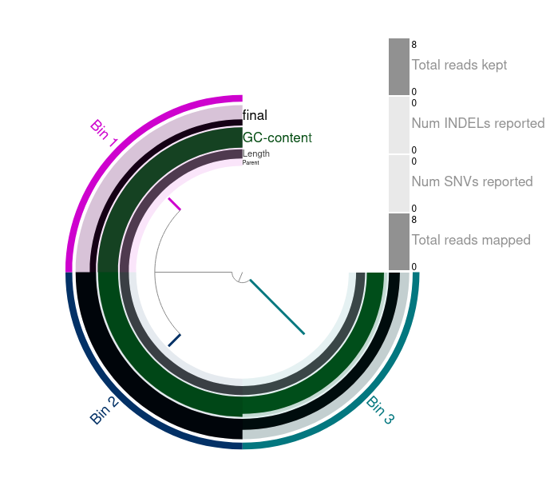

## anvi-reformat-bam

This repository contains a script to reformat BAM to be used by [anvi'o](http://merenlab.org/software/anvio/),
after the reference contig file has been reformatted using `anvi-script-reformat-fasta`.

The program requires the BAM file and the tabular file produced by `anvi-script-reformat-fasta --report FILE`.

```text
usage: anvi-reformat-bam [-h] -i INPUT -o OUTPUT -l LIST [--verbose]

Rename contigs in BAM file

options:
  -h, --help            show this help message and exit
  -i INPUT, --input INPUT
                        Input BAM file
  -o OUTPUT, --output OUTPUT
                        Output BAM file
  -l LIST, --rename-list LIST
                        tabular file produced by "anvi-script-reformat-fasta --report file"
  --verbose             Verbose output
```

### Test files

The **test** directory contains a simple reference (FASTA) and a paired-end dataset (FASTQ).

|File                     |#Seq|Total bp |
|-------------------------|---:|----:|
|test/input/ref.fa        |3   |751  |
|test/input/reads_R1.fq.gz|5   |500  |
|test/input/reads_R2.fq.gz|5   |500  |

```text
├── bin
│   └── anvi-reformat-bam
└── test
    ├── input
    │   ├── reads_R1.fq.gz
    │   ├── reads_R2.fq.gz
    │   └── ref.fa
    └── output
```

Running the Makefile  (`make`) will:

* index the reference (`bwa index`), 
* align the reads (`bwa mem`), 
* reformat the fasta file (`script-reformat-fasta`),
* and reformat the BAM file (using this repository's scripts).

```text
└── test
    ├── REFORMAT.fa             (reformatted FASTA file)
    ├── REPORT_FILE.txt         (table made by "anvi-script-reformat-fasta --report REPORT_FILE.txt")
    ├── input
    │   ├── raw.bam
    │   ├── raw.bam.csi
    │   ├── reads_R1.fq.gz
    │   ├── reads_R2.fq.gz
    │   ├── ref.fa
    │   ├── ref.fa.amb
    │   ├── ref.fa.ann
    │   ├── ref.fa.bwt
    │   ├── ref.fa.pac
    │   └── ref.fa.sa
    └── output
        └── formatted.bam        (reformatted BAM file)
```

How the SAM file looks like after reformatting:

|readname|flag|ref           |position|quality|CIGAR|mate_ref|mate_pos|mate_dist|
|--------|---:|--------------|-------:|------:|-----|--------|-------:|--------:|
|read_1  |97  |c_000000000001|1       |60     |100M |=       |101     |200      |
|read_1  |145 |c_000000000001|101     |60     |100M |=       |1       |-200     |
|read_2  |97  |c_000000000002|1       |31     |100M |=       |101     |200      |
|read_3  |97  |c_000000000002|51      |0      |100M |=       |151     |200      |
|read_2  |145 |c_000000000002|101     |0      |100M |=       |1       |-200     |
|read_4  |117 |c_000000000002|106     |0      |*    |=       |106     |0        |
|read_4  |185 |c_000000000002|106     |0      |100M |=       |106     |0        |
|read_3  |145 |c_000000000002|151     |15     |100M |=       |51      |-200     |
|read_5  |73  |c_000000000003|51      |0      |100M |=       |51      |0        |
|read_5  |133 |c_000000000003|51      |0      |*    |=       |51      |0        |

### Test with anvio

If you are inside the Anvi'o environment you can run `make anvio` to also 

* generate the contig database
* import the new BAM as profile
* run `anvi-interactive`

